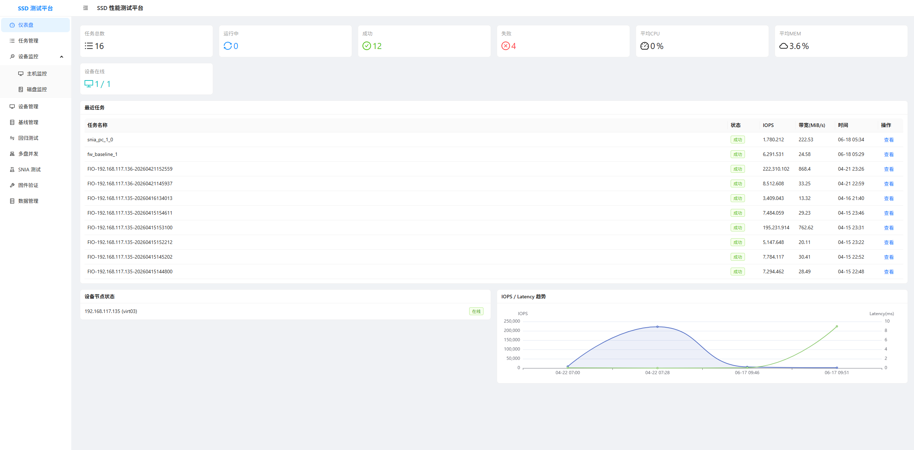
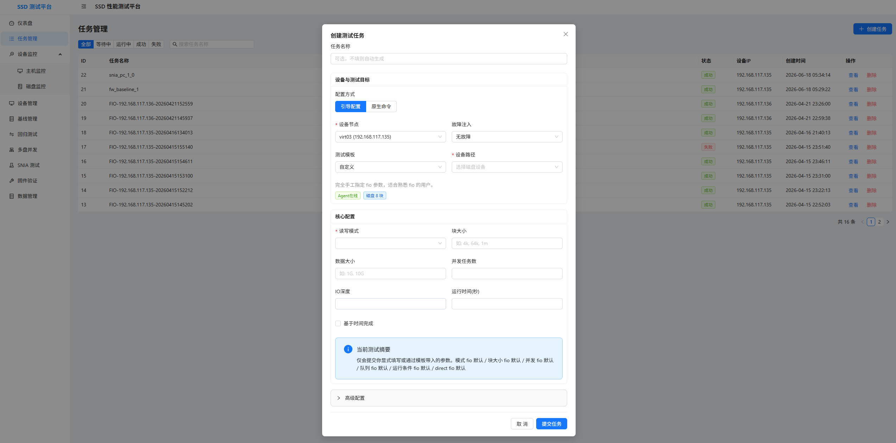
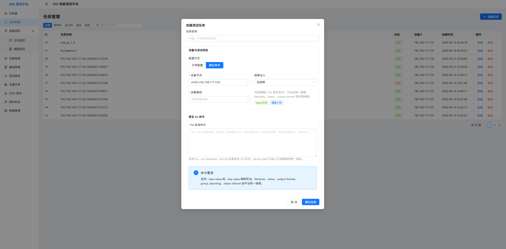
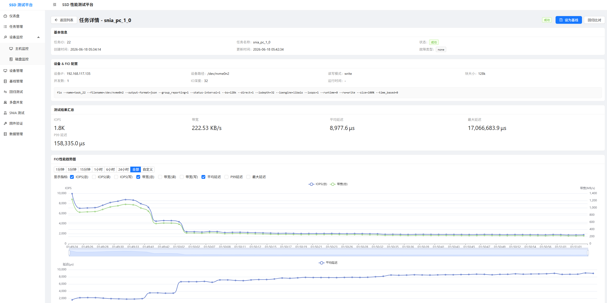
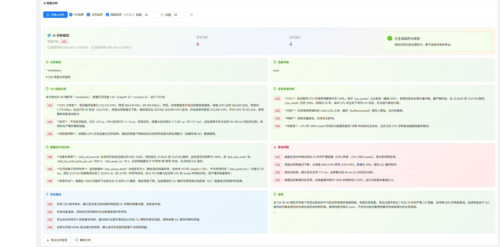
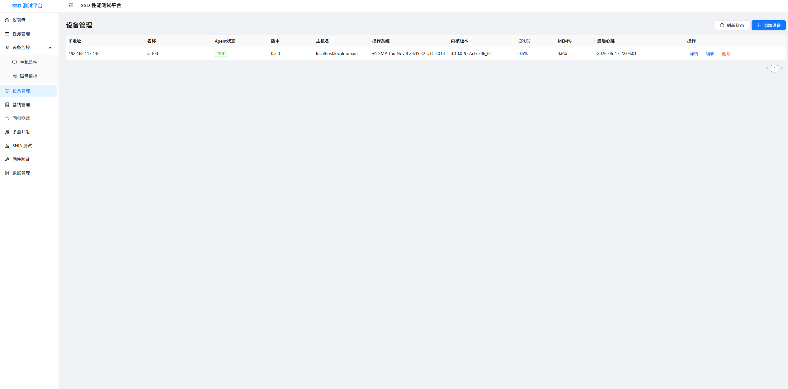
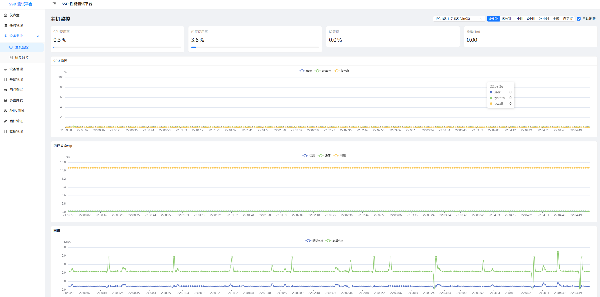
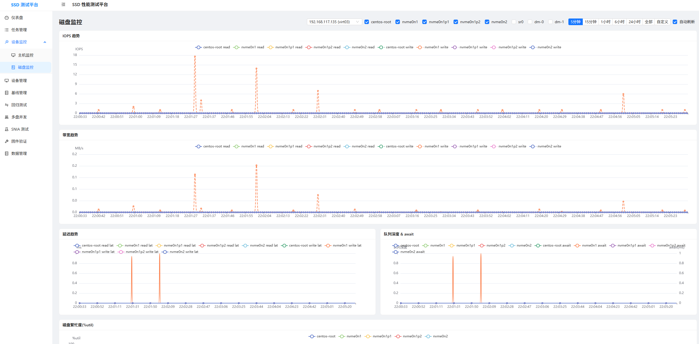
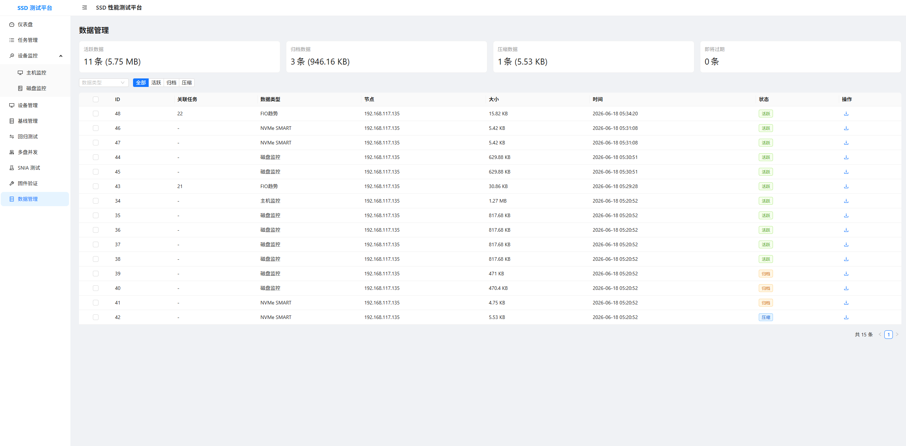

# SSD Engine

SSD Engine 是一个面向 SSD/NVMe 性能测试与运行态观测的一体化平台，核心目标是把“测试执行、状态采集、趋势留存、智能分析”串成可追踪闭环。

## 1. 产品介绍

### 1.1 产品定位

SSD Engine 用于研发验证、性能回归、环境验收等场景，解决以下问题：

- 任务执行链路分散，测试参数和结果难追溯
- 只看 fio 输出，缺少测试窗口内系统与磁盘状态上下文
- 结果解读依赖人工经验，分析效率低
- 多设备测试协同成本高

### 1.2 核心能力

- FIO 任务管理：创建、执行、停止、重试、趋势查看
- 设备管理：节点接入、状态刷新、连通性校验
- 监控数据采集：主机与磁盘指标按时间序列留存
- 数据生命周期管理：归档、压缩、清理、下载
- AI 分析：聚合任务与监控上下文生成分析报告

### 1.3 典型使用流程

1. 在设备节点部署 Agent
2. 在平台录入设备并校验在线状态
3. 创建 FIO 任务并下发至对应 Agent
4. 实时查看任务趋势与设备监控
5. 触发 AI 分析并沉淀报告

## 2. 架构说明

### 2.1 总体架构

```text
Frontend (React + Vite)
        |
        | REST API
        v
Backend (Flask + MySQL)
        |
        | Agent HTTP API
        v
Agent (部署在设备节点)
        |
        +-- 执行 fio
        +-- 采集主机监控
        +-- 采集磁盘监控
        +-- 采集 SMART 信息
```

### 2.2 分层职责

- Frontend：交互、可视化、任务编排入口
- Backend：业务编排、数据存储、AI 分析、生命周期管理
- Agent：靠近设备执行实际测试并采集底层指标

### 2.3 仓库结构

```text
ssd_engine/
├── agent/        设备节点 Agent
├── backend/      平台后端 API 与业务服务
├── frontend/     前端界面与交互
├── docs/         设计与补充文档
├── logs/         运行日志
└── data/         归档/样例数据
```

## 3. 页面截图展示位

以下区域为 README 截图展示位，图片文件建议统一放在 `docs/screenshots/` 下。

### 3.1 仪表盘总览



展示任务总览、设备状态和全局趋势。

### 3.2 任务创建（引导模式）



展示模板选择、关键参数配置和任务摘要。

### 3.3 任务创建（原生命令模式）



展示 fio CLI 直接输入和参数解析入口。

### 3.4 任务详情（趋势）



展示 IOPS、带宽、延迟趋势和任务状态。

### 3.5 任务详情（AI 分析）



展示分析窗口、分析报告与结论摘要。

### 3.6 设备管理



展示设备列表、Agent 状态、最后心跳与刷新操作。

### 3.7 主机监控



展示 CPU、内存、网络等主机级监控信息。

### 3.8 磁盘监控



展示磁盘 IOPS、带宽、延迟和队列等核心指标。

### 3.9 数据管理



展示数据筛选、归档、压缩、下载和删除操作。

> 若当前截图文件尚未补充，页面会显示图片占位；补图后 README 将自动生效。

## 4. 配置说明

本项目采用“分模块独立配置”模式，推荐通过环境变量管理。

### 4.0 各版本要求

为避免运行时差异，建议优先按下表准备环境。

| 模块 | 组件 | 最低版本 | 推荐版本 | 说明 |
|------|------|------|------|------|
| 通用 | 操作系统 | Windows 10 / Ubuntu 20.04 / CentOS 8 | Ubuntu 22.04 LTS | Agent 建议部署在 Linux 设备节点 |
| 通用 | Python | 3.10 | 3.11 | Agent 与 Backend 均使用 Python |
| 通用 | Node.js | 18 | 20 LTS | Frontend 构建与开发 |
| 通用 | npm | 9 | 10 | 与 Node.js LTS 配套 |
| 通用 | MySQL | 8.0 | 8.0.x 最新稳定版 | Backend 持久化存储 |
| Agent | fio | 3.28 | 3.35+ | 性能测试执行核心依赖 |
| Agent | nvme-cli | 1.14 | 2.x | SMART 采集可选但推荐 |
| Backend | Flask | 3.1 | 3.1.x | Web API 框架 |
| Backend | Flask-SQLAlchemy | 3.1 | 3.1.x | ORM |
| Backend | APScheduler | 3.10 | 3.10.x | 生命周期定时任务 |
| Frontend | React | 18 | 18.3.x | 页面框架 |
| Frontend | TypeScript | 5 | 5.x | 类型系统 |
| Frontend | Vite | 5 | 5.x | 构建工具 |

补充说明：

- 若使用 AI 分析功能，需可访问 `AI_BASE_URL` 指向的 OpenAI 兼容服务，并配置 `AI_API_KEY`。
- Windows 环境可用于本地联调；生产环境建议 Backend 与 Agent 使用 Linux。
- 首次部署建议统一使用同一大版本（Python、Node.js、MySQL）避免驱动和依赖偏差。

### 4.1 通用依赖

- Python 3.10+
- Node.js 18+
- MySQL 8.x

### 4.2 Agent 关键配置

- `AGENT_HOST`：监听地址（默认 `0.0.0.0`）
- `AGENT_PORT`：监听端口（默认 `8080`）
- `BACKEND_URL`：后端地址
- `AGENT_DEVICE_IP`：设备 IP（需与后端设备记录一致）
- `FIO_INGEST_INTERVAL_SECONDS`：FIO 趋势上报间隔
- `DISK_INGEST_INTERVAL_SECONDS`：磁盘监控上报间隔

### 4.3 Backend 关键配置

- `MYSQL_HOST` / `MYSQL_PORT` / `MYSQL_USER` / `MYSQL_PASSWORD` / `MYSQL_DATABASE`
- `APP_HOST` / `APP_PORT`
- `AI_API_KEY` / `AI_BASE_URL` / `AI_MODEL`
- `MONITOR_RETENTION_DAYS`（监控保留策略）

### 4.4 Frontend 关键配置

- 开发模式通过 `vite.config.ts` 将 `/api` 代理到 Backend
- 生产环境通过 Nginx 反向代理 `/api` 到 Backend

## 5. 部署说明

推荐启动顺序：Agent -> Backend -> Frontend。

### 5.1 最小可运行部署

#### 步骤 1：启动 Agent

```bash
cd agent
pip install -r requirements.txt
python agent_server.py
```

#### 步骤 2：初始化并启动 Backend

```bash
cd backend
pip install -r requirements.txt
python run.py
```

说明：首次运行前请先执行 `backend/init_mysql.sql` 完成数据库初始化。

#### 步骤 3：启动 Frontend

```bash
cd frontend
npm install
npm run dev
```

### 5.2 生产部署建议

- Frontend：`npm run build` 后由 Nginx 托管静态资源
- Backend：使用 Gunicorn 等 WSGI 进程托管 Flask
- MySQL：独立实例，开启备份策略
- Agent：每台被测设备部署一个实例，建议 systemd 托管

### 5.3 端口规划建议

- Frontend：3000（开发）/ 80 或 443（生产）
- Backend：5000
- Agent：8080（可按节点区分）
- MySQL：3306

## 6. 子模块文档

- `agent/README.md`：Agent 架构、采集与执行逻辑、Agent API
- `backend/README.md`：Backend 分层架构、核心业务编排、平台 API
- `frontend/README.md`：前端架构、页面业务流、前后端接口映射
